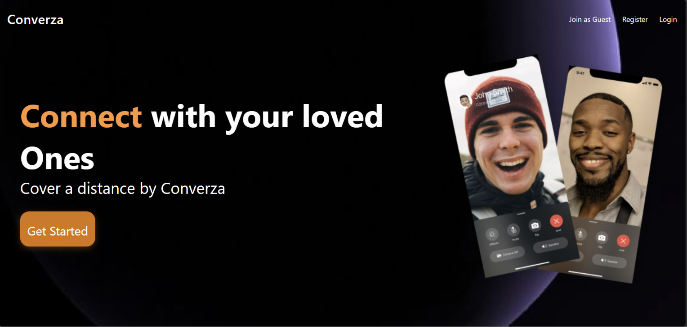
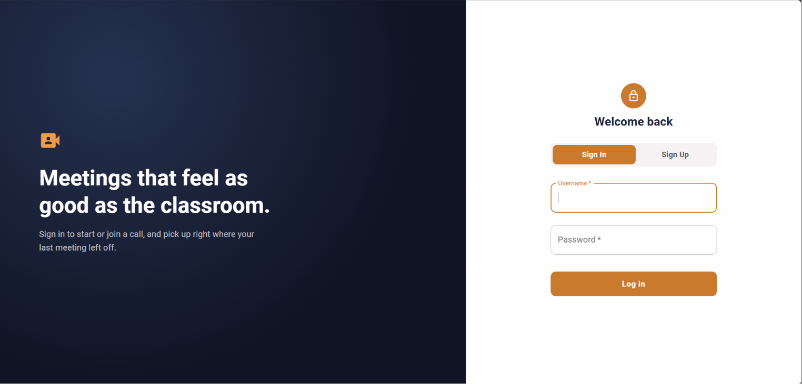
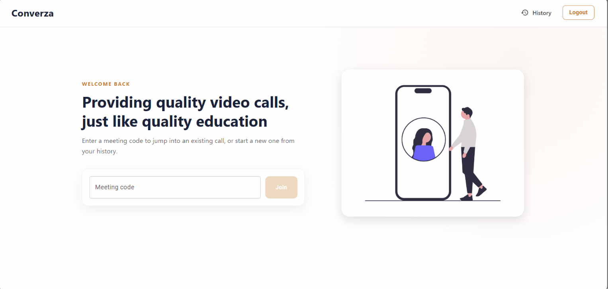
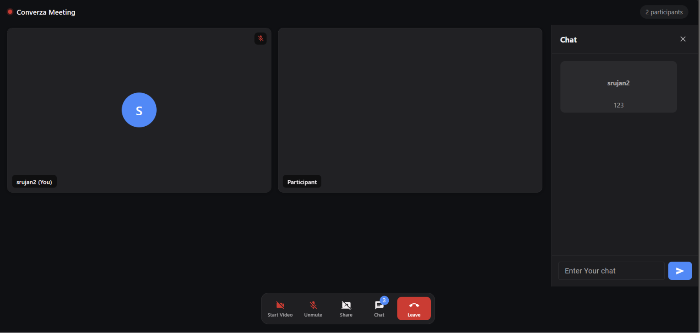
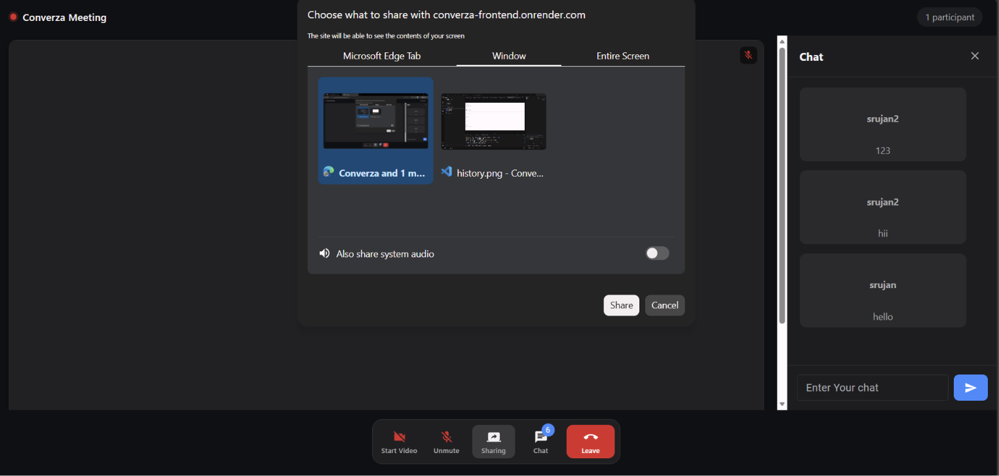
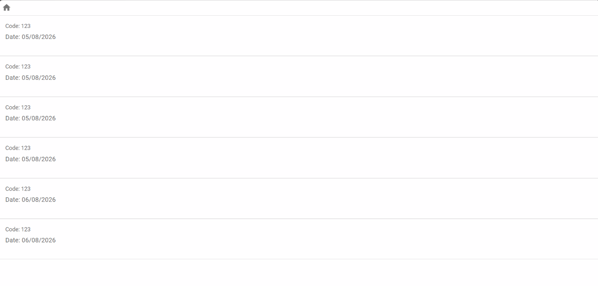

# 🎥 Converza

<div align="center">

### A Modern Real-Time Video Conferencing Platform

Build secure video meetings, collaborate through live chat, share your screen, and connect instantly from anywhere.

**Live Demo:** https://converza-frontend.onrender.com


</div>

---

## 📖 Overview

**Converza** is a full-stack real-time video conferencing web application built using the **MERN Stack**, **WebRTC**, and **Socket.IO**.

The platform enables users to create or join meetings instantly, communicate through high-quality video and audio, share screens, exchange messages in real time, and maintain a history of previous meetings.

Designed with scalability, performance, and simplicity in mind, Converza demonstrates modern web development practices and real-time communication technologies.

---

# ✨ Features

### 🔐 Secure Authentication
- User Registration
- User Login
- Password encryption using **bcrypt**
- Guest meeting access

### 📹 HD Video Conferencing
- Real-time peer-to-peer video calling
- Multi-user meeting support
- Camera On/Off
- Microphone Mute/Unmute

### 🖥 Screen Sharing
- Share your screen instantly
- Smooth presentation experience
- Browser-native WebRTC support

### 💬 Real-Time Chat
- Instant messaging during meetings
- Socket.IO powered communication
- Low latency message delivery

### 👥 Meeting Management
- Create meetings
- Join meetings using Meeting ID
- Share meeting links with participants

### 📜 Meeting History
- View previous meetings
- Track activity after login
- Persistent storage using MongoDB

### ⚡ Modern User Experience
- Responsive Interface
- Material UI Components
- Clean Navigation
- Fast React Rendering

---

# 🛠 Tech Stack

## Frontend

- React.js
- React Router
- Material UI (MUI)
- Axios
- Socket.IO Client
- WebRTC APIs

---

## Backend

- Node.js
- Express.js
- Socket.IO
- MongoDB
- Mongoose
- bcrypt
- dotenv

---

## Deployment

- Frontend: Render
- Backend: Render
- Database: MongoDB Atlas

---

# 📂 Project Structure

```
Converza
│
├── frontend
│   ├── public
│   ├── src
│   │   ├── pages
│   │   ├── contexts
│   │   ├── utils
│   │   ├── components
│   │   └── App.js
│   │
│   └── package.json
│
├── backend
│   ├── src
│   │   ├── controllers
│   │   ├── models
│   │   ├── routes
│   │   ├── app.js
│   │   └── socketManager.js
│   │
│   └── package.json
│
└── README.md
```

---

# 🚀 Live Demo

### 🌐 Application

https://converza-frontend.onrender.com

---

# ⚙ Installation

## Clone the Repository

```bash
git clone https://github.com/Srujan-017/Converza.git

cd converza
```

---

## Backend Setup

```bash
cd backend

npm install
```

Create a `.env` file:

```env
MONGODB_URI=your_mongodb_connection_string
PORT=8000
```

Run backend:

```bash
npm run dev
```

---

## Frontend Setup

```bash
cd frontend

npm install
```

Create a `.env` file:

```env
REACT_APP_SERVER_URL=http://localhost:8000
```

Run frontend:

```bash
npm start
```

---

# 🌍 Environment Variables

## Backend

```env
PORT=8000

MONGODB_URI=your_mongodb_connection_string
```

## Frontend

```env
REACT_APP_SERVER_URL=http://localhost:8000
```

---

# 🔄 Application Workflow

```text
User Authentication
        │
        ▼
Create / Join Meeting
        │
        ▼
Socket.IO Signaling Server
        │
        ▼
WebRTC Peer Connection
        │
 ┌──────┴────────┐
 ▼               ▼
Video Call     Screen Share
        │
        ▼
Real-Time Chat
        │
        ▼
Meeting History Saved
```

---

# 📡 API Endpoints

## Authentication

| Method | Endpoint |
|---------|----------|
| POST | `/api/v1/users/register` |
| POST | `/api/v1/users/login` |

---

## Meeting Activity

| Method | Endpoint |
|---------|----------|
| POST | `/api/v1/users/add_to_activity` |
| GET | `/api/v1/users/get_all_activity` |

---

# 💡 Key Highlights

- Full Stack MERN Application
- Real-Time Communication
- WebRTC Video Calling
- Socket.IO Signaling
- Secure Authentication
- Screen Sharing
- Responsive Design
- MongoDB Database Integration
- Meeting History Tracking

---

# 🔮 Future Enhancements

- Meeting Scheduling
- Waiting Room
- Virtual Backgrounds
- Meeting Recording
- Live Captions
- File Sharing
- Emoji Reactions
- Admin Dashboard
- AI Meeting Summaries
- End-to-End Encryption

---

# 📸 Screenshots

Experience Converza through its clean, modern, and intuitive interface.

| Landing Page | Login Page |
|--------------|------------|
|  |  |

| Home Dashboard | Chat Panel |
|----------------|------------|
|  |  |

| Screen Sharing | Meeting History |
|----------------|-----------------|
|  |  |

> **Note:** The Video Meeting screenshot will be added in a future update.

# 🤝 Contributing

Contributions, issues, and feature requests are always welcome.

1. Fork the repository
2. Create a new feature branch

```bash
git checkout -b feature-name
```

3. Commit your changes

```bash
git commit -m "Added new feature"
```

4. Push to your branch

```bash
git push origin feature-name
```

5. Open a Pull Request

---

# 👨‍💻 Developer

**Srujan V**

Passionate Full Stack Developer focused on building scalable web applications and real-time communication platforms using modern technologies.

GitHub: https://github.com/Srujan-017

---

# ⭐ Support

If you found this project useful, consider giving it a ⭐ on GitHub.

It motivates future development and helps others discover the project.

---

## 📄 License

This project is licensed under the MIT License.

```
MIT License

Copyright (c) 2026 Srujan V

Permission is hereby granted, free of charge,
to any person obtaining a copy of this software...
```

---

<div align="center">

### ⭐ Thank you for visiting Converza!

Built with ❤️ using React, Node.js, MongoDB, Socket.IO and WebRTC.

</div>
